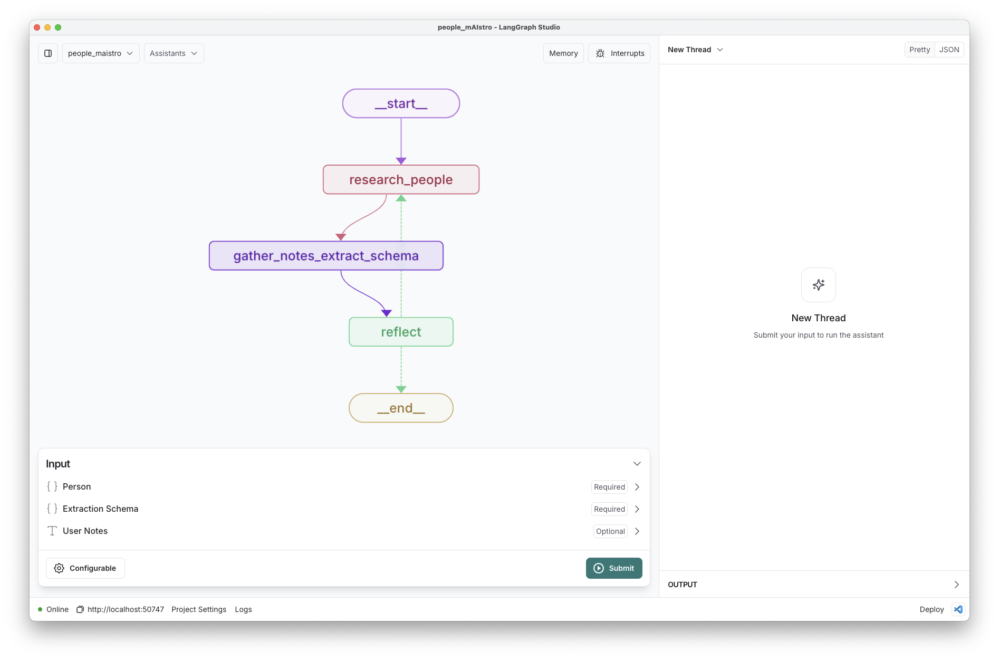
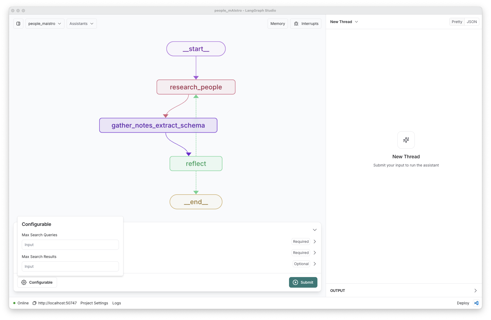

# People mAIstro

People mAIstro researches information about a user-supplied list of people, and returns it in any user-defined schema.

## Quickstart

1. Populate the `.env` file: 
```
$ cp .env.example .env
```

2. Load this folder in [LangGraph Studio](https://github.com/langchain-ai/langgraph-studio?tab=readme-ov-file#download) 

3. Provide a schema for the output, and pass in a company name. 

4. Run the graph just inputting a `person` email.

* A schema (see below for details) is optional. It will use a default schema defined [here](https://github.com/langchain-ai/company_mAIstro/blob/main/people_maistro.py#L170) if none is provided.
* Additional user notes about the person can be provided as a text field, and will be included in the research process. 

    

## Overview

 People mAIstro follows a [plan-and-execute workflow](https://github.com/assafelovic/gpt-researcher) that separates planning from research, allowing for better resource management and significantly reducing overall research time:

   - **Planning Phase**: An LLM analyzes the user's set of people to research and returns a list. 
   - **Research Phase**: The system parallelizes web research across all people in parallel:
     - Uses [Tavily API](https://tavily.com/) for targeted web searches, performing up to `max_search_queries` queries per person.
     - Performs web searches for each person in parallel and returns up to `max_search_results` results per query.
   - **Extract Schema**: After research is complete, the system uses an LLM to extract the information from the research in the user-defined schema.
   - **Reflection Phase**: The system analyzes the extracted information for completeness and quality:
     - Checks for missing or incomplete information
     - Identifies uncertain data that needs verification
     - Looks for contradictions in the gathered data
     - If needed, triggers additional research with refined search queries

## Configuration

The configuration for People mAIstro is defined in the `configuration.py` file: 
* `max_search_queries`: int = 3 # Max search queries per company
* `max_search_results`: int = 3 # Max search results per query

These can be added in Studio:



## Inputs 

The user inputs are: 

```
* person: a JSON object with the following fields:
    - `email` (required): The email of the person
    - `name` (optional): The name of the person
    - `company` (optional): The current company of the person
    - `linkedin` (optional): The Linkedin URL of the person
    - `role` (optional): The current title of the person
* schema: Optional[dict] - A JSON schema for the output
* user_notes: Optional[str] - Any additional notes about the people from the user
```

If a schema is not provided, the system will use a default schema (`DEFAULT_EXTRACTION_SCHEMA`) defined in `people_maistro.py`.

### Schema

> ⚠️ **WARNING:** JSON schemas require `title` and `description` fields for [extraction](https://python.langchain.com/docs/how_to/structured_output/#typeddict-or-json-schema).
> ⚠️ **WARNING:** Avoid JSON objects with nesting; LLMs have challenges performing structured extraction from nested objects. 

Here is an example schema that can be supplied to research a company:  

```
{
    "type": "object",
    "required": [
      "Years-Experience",
      "Company",
      "Role",
      "Prior-Companies",
    ],
    "properties": {
      "Role": {
        "type": "string",
        "description": "Current role of the person."
      },
      "Years-Experience": {
        "type": "number",
        "description": "How many years of full time work experience (excluding internships) does this person have."
      },
      "Company": {
        "type": "string",
        "description": "The name of the current company the person works at."
      },
      "Prior-Companies": {
        "type": "array",
        "items": {
          "type": "string"
        },
        "description": "List of previous companies where the person has worked"
      }
    },
    "description": "Person information",
    "title": "Person-Schema",
}
```

## Evaluation

Please see instructions on how to run evals [here](https://github.com/langchain-ai/agent-evals/tree/main/people_data_enrichment).
